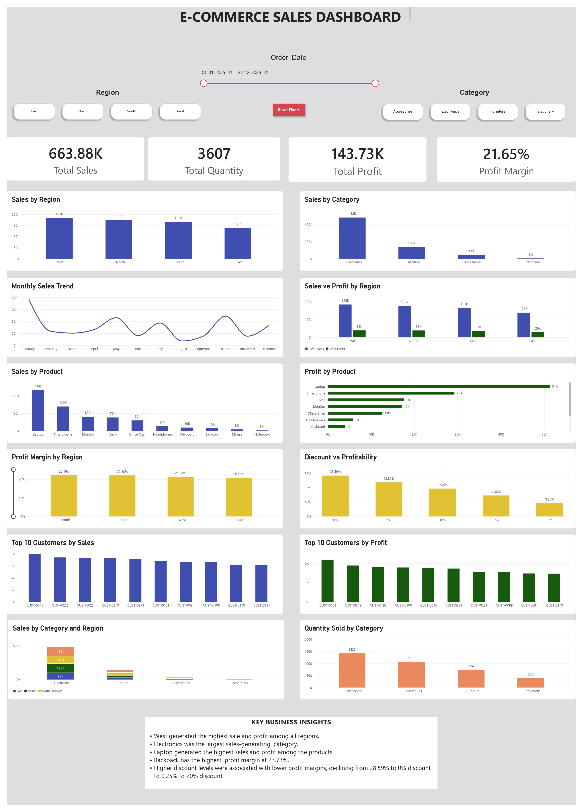

# E-commerce-sales-analysis

## Business Problem
An e-commerce business wants to understand its sales and profitability performance across different regions,product categories, products, customers, and months.

The objective of this analysis is to identify key sales drivers, understand regional and product performance,evaluate the relationship between discounts and  profitability, and identify high-value customers.

The analysis uses SQL and PowerBI to transform raw sales data into meaningful business insights that can support data-driven decision-making.

## Key Business Questions

- Which region generates the highest sales and profit?
- Which categories contribute most to revenue?
- Which products perform best and worst?
- How does profitability vary by region?
- How are discounts associated with profit margins?
- Who are the top customers by sales and profit?
- How do sales change month to month?
- Which products lead sales in each region?
- Which region performs best for each category?

## Dataset
The Dataset is an Excel file containing E-commerce information,including order dates, customers, products, categories, regions, quantities, discounts, sales and profit.

## Tools Used
- MySQL
- Power BI
- Excel

## Project Highlights

- Analyzed 1,200 e-commerce orders using MySQL,Excel, and Power BI.
- Built SQL queries using aggregation, grouping, sorting, and window functions.
- Created and interactive Power BI dashboard with KPI cards, charts, and slicers.
- Analyzed regional, category, product, customer, and monthly sales performance.
- Examined the relationship between discount levels and profit margins.
- Identified top-performing products, regions and customers.

## Dashboard

The Power BI dashboard provides an interactive view of:



- Sales and profit KPIs
- Regional performance
- Category performance
- Product performance
- Monthly sales trends
- Customer performance
- Discount vs Profitability
- Profit Margins
- Quantity sold

## Key Insights

- West generated the highest sales and profit among all regions.
- Electronics was the largest sales-generating category.
- Laptop generated the highest sales and profit among products.
- Backpack had the highest profit margin at 23.73%.
- Higher discount levels were associated with lower profit margins, declining from 28.59% at 0% discount to 9.25% at 20% discount.

## Business Recommendations

- Review regional performance to identify opportunities for improving sales in lower-performing regions.
- Focus on high-performing products such as Laptop while monitoring the performance of lower-selling products.
- Monitor discount levels carefully because higher discounts were associated with lower profit margins.
- Identify and retain high-value customers through targeted offers and customer engagement strategies.
- Analyze monthly sales trends to support inventory and sales planning.

## Project Structure

```text
ecommerce-sales-analysis/
├── Data/
│   └── E-commerce-sales.xlsx
├── Power BI/
│   └── E-COMMERCE.pbix
├── Screenshots/
│   └── Dashboard.png
├── sql/
│   ├── 01_sales_analysis.sql
│   ├── 02_customer_analysis.sql
│   └── 03_product_analysis.sql
└── README.md


